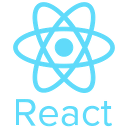

[React_Cheatsheet_Zero_To_Mastery_V1.02.pdf](https://file.notion.so/f/f/57e12b3a-61bc-81b9-a51f-0003f3409948/3567a192-5182-4dc4-a8c3-44b8c5411836/React_Cheatsheet_Zero_To_Mastery_V1.02.pdf?table=block&id=36212b3a-61bc-804b-aa07-e62515fe2c00&spaceId=57e12b3a-61bc-81b9-a51f-0003f3409948&expirationTimestamp=1779321600000&signature=ZUo5ecwO4Ke9UmagNqf2gjwvUdHqDPi6Du1XlXrFuI8&downloadName=React_Cheatsheet_Zero_To_Mastery_V1.02.pdf)

## Lesson 1:

## Reacts Basics and JSX

### What is React?

React is an external library that helps create websites easier.

What is External Library?

1. Code that is outside our computer.
2. Code that someone else wrote.

React is an External Library

1. It’s a bunch of code that is outside our computer.
2. We can load this code on our website, and use it.

React can be used in different places:

1. Websites
2. Mobile Apps

```html
<script
  crossorigin
  src="https://unpkg.com/react@18/umd/react.development.js"
></script>
```

React = shared features

```html
<script
  crossorigin
  src="https://unpkg.com/react-dom@18/umd/react-dom.development.js"
></script>
```

ReactDOM = features specific to websites

Using React to create Websites:

= load React & ReactDOM

Using React to create mobile apps:

= load React & ReactNative

### What is Babel?

Babel = JavaScript Compiler, translates other languages into JavaScript

### What is JSX?

JSX = JavaScript XML

same as JavaScript, but we can directly write HTML in our JavaScript code.

React CDN

```html
<script
  crossorigin
  src="https://unpkg.com/react@18/umd/react.development.js"
></script>
<script
  crossorigin
  src="https://unpkg.com/react-dom@18/umd/react-dom.development.js"
></script>
<script src="https://unpkg.com/@babel/standalone/babel.min.js"></script>
```

### Problem with JSX?

Web Brower doesn't understand JSX.

In order to use Use JSX -> Need to translate JSX into JavaScript

Babel = translates JSX into JavaScript

```html
<script src="https://unpkg.com/@babel/standalone/babel.min.js"></script>

<script type="text/babel"></script>

```

### Advantages of Using React?
1. Creating Websites with React feels natural
2. JSX lets us find errors easier
3. We can insert JavaScript Code inside JSX elements